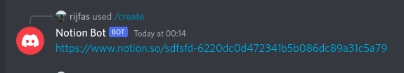
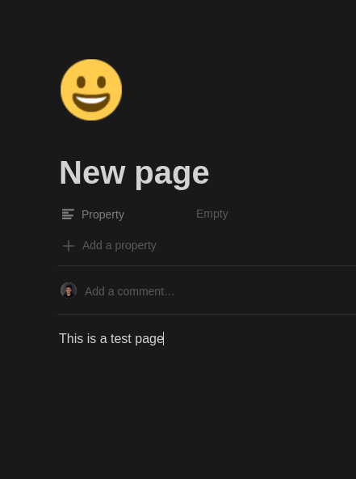

# Notion Bot

Create notion pages inside discord.

## How to setup

1. Create a notion integration form [here](https://www.notion.so/my-integrations).
2. Set api key in `.env` as `NOTION_TOKEN`
3. Create a notion database and set database id in `.env` as `NOTION_DATABASE_ID`
4. Create a discord bot and set bot token in `.env` as `CLIENT_TOKEN`
5. Set bot's application id in `.env` as `APP_ID`
6. Set servers id in `.env` as `GUILD_ID`
7. run `npm run reg` to register the commands
8. run `npm start` to run the bot

## Example Run:

## Team Members

[Rijfas](https://github.com/rijfas)

[Amjad CP](https://github.com/rijfas)

[Nidha Shoukhath K P](https://github.com/rijfas)
