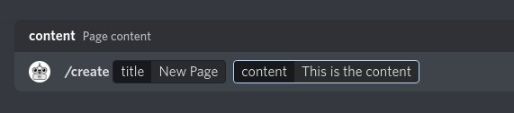
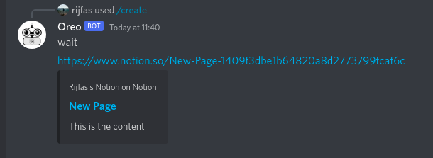

  

  <h3 align="center">Oreo Bot</h3>

  

    Oreo is a simple Notion Bot that creates notion pages inside discord.
     
    <a href="https://github.com/amjadcp/SHN-Notion-API/"><strong>Explore the docs »</strong></a>
     
     
    <a href="https://discord.com/api/oauth2/authorize?client_id=972507401922170920&scope=applications.commands">Add to your discord server</a>
    ·
    <a href="https://github.com/amjadcp/SHN-Notion-API//issues">Report Bug</a>
    ·
    <a href="https://github.com/amjadcp/SHN-Notion-API//issues">Request Feature</a>
  

## About the project

- It helps to create notion pages randomly from the discord server itself
- Helpful during discussions to save major decisions into a database
- Makes event management easier

## Project walkthrough

## How to setup

1. Create a notion integration form [here](https://www.notion.so/my-integrations).
2. Set api key in `.env` as `NOTION_TOKEN`
3. Create a notion database and set database id in `.env` as `NOTION_DATABASE_ID`
4. Create a discord bot and set bot token in `.env` as `CLIENT_TOKEN`
5. Set bot's application id in `.env` as `APP_ID`
6. Set servers id in `.env` as `GUILD_ID`
7. run `npm run reg` to register the commands
8. run `npm start` to run the bot

## Example Run:

### Running the `/create` command:

### Bot's reply with created notion page:

### Created notion page:

## Team Members

[Rijfas](https://github.com/rijfas)

[Amjad CP](https://github.com/amjadcp)

[Nidha Shoukhath K P](https://github.com/nidhashoukhath)
